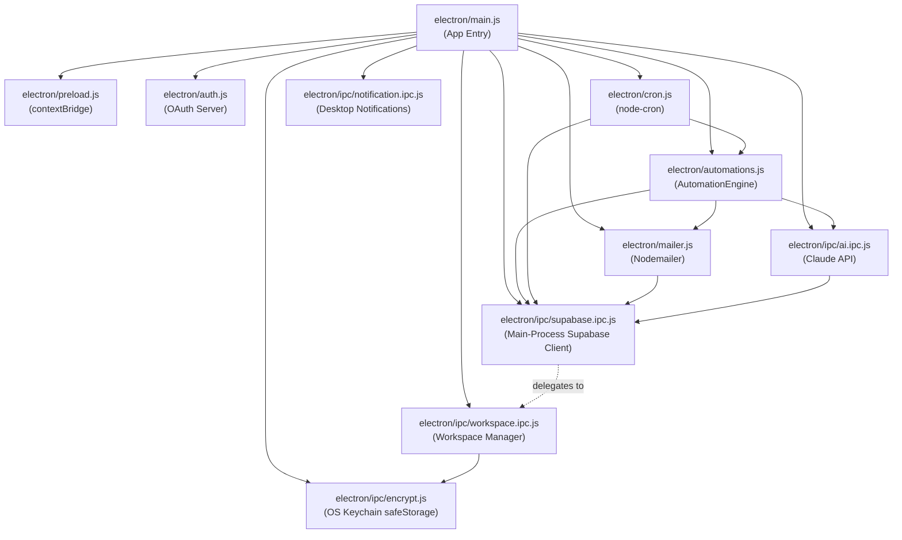
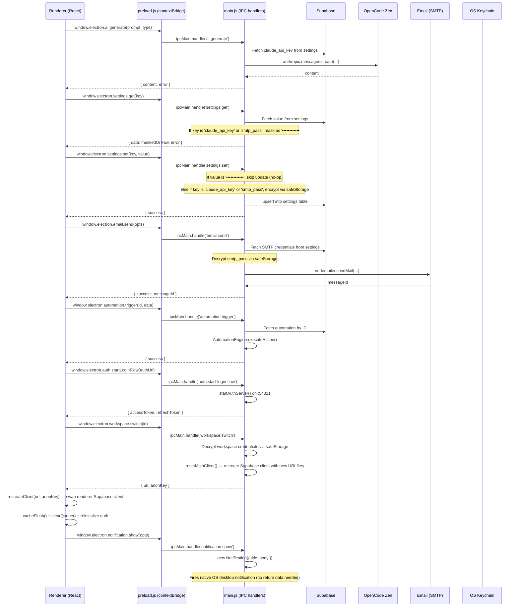
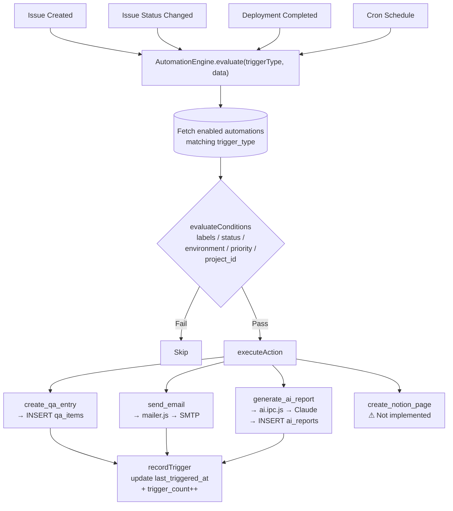

# CommandCenter — Complete Project Reference & Dependency Graph

> **Purpose:** Drop this file into any AI chat to give full context about the CommandCenter project.  
> **Generated from:** Source analysis of `/CommandCenter` workspace (v1.0.6)

---

## 1. Project Overview

**CommandCenter** is a cross-platform **Electron + React desktop app** for product/project management. It is a unified PM hub covering issues, QA, deployments, sprints, AI reports, and workflow automations — all backed by a hosted **Supabase** (PostgreSQL) database.

| Property | Value |
|---|---|
| App ID | `com.commandcenter.app` |
| Version | `1.0.6` |
| Entry (Electron) | `electron/main.js` |
| Entry (Renderer) | `src/main.jsx` → `src/App.jsx` |
| Auth | Supabase Google OAuth (allowlist-gated) |
| Database | Supabase (PostgreSQL) — hosted |
| AI Engine | OpenCode Zen (`claude-sonnet-4-6` via Anthropic-compatible endpoint `https://opencode.ai/zen/v1`) |
| Email | Nodemailer via SMTP (credentials stored in DB) |
| Native Notifications | Electron Notification API (OS-native) |
| Build tool | Vite 6 + electron-builder 25 |
| UI Framework | React 18 + TailwindCSS 3 |
| State Management | Zustand 5 |
| Routing | React Router DOM 6 (HashRouter) |
| Testing | Vitest 4 + jsdom (64 tests across 5 files) |
| UI Polish | v1.0.6 — responsive layout pass across all major pages (consistent card heights via `min-h`, compressed spacing `gap-6→gap-4`, TopBar overflow handling, Import visual progress indicator) |
| AI Provider | v1.0.6 — switched from direct Anthropic Claude API to OpenCode Zen gateway (`claude-sonnet-4-6` via `https://opencode.ai/zen/v1`); API key renamed to `zen_api_key` |

---

## 2. High-Level Architecture

```
┌─────────────────────────────────────────────────────────────────┐
│                        Electron Shell                           │
│                                                                 │
│  ┌──────────────────────────────────────┐  ┌────────────────┐  │
│  │         Main Process (Node.js)       │  │  Renderer (V8) │  │
│  │                                      │  │                │  │
│  │  main.js ──► registerIpcHandlers()   │  │  React 18 App        │  │
│  │      ├── ipc/supabase.ipc.js         │◄─┤  (Vite bundle)       │  │
│  │      ├── ipc/ai.ipc.js               │  │                      │  │
│  │      ├── ipc/workspace.ipc.js        │  │  window.electron     │  │
│  │      ├── ipc/notification.ipc.js     │  │  (preload API)       │  │
│  │      ├── ipc/encrypt.js              │  │                      │  │
│  │      ├── mailer.js                   │  │  Features:           │  │
│  │      ├── auth.js                     │  │  • Dashboard + Charts│  │
│  │      ├── automations.js              │  │  • Sprint Board (DnD)│  │
│  │      └── cron.js                     │  │  • Notifications Hub │  │
│  │                                      │  │  • Bulk Import Tool  │  │
│  │  preload.js ──► contextBridge        │  │  • Time Tracking     │  │
│  └──────────────────────────────────────┘  │  • Workspace Manager │  │
│                          │                  │  • Command Palette   │  │
│                    IPC Channels             │  • Conflict Resolver │  │
│  (supabase:query, ai:generate, email:send,  └──────────────────────┘  │
│   automation:trigger, settings:get/set,                                │
│   export:all, auth:start-login-flow,                                   │
│   workspace:list/add/remove/switch,                                    │
│   notification:show)                                                   │
└─────────────────────────────────────────────────────────────────┘
                           │
                    ┌──────▼──────┐
                    │  Supabase   │
                    │ (PostgreSQL)│
                    │             │
                     │ Tables:      │
                     │ products     │
                     │ clients      │
                     │ projects     │
                     │ issues       │
                     │ qa_items     │
                     │ deployments  │
                     │ sprints      │
                     │ ai_reports   │
                     │ automations  │
                     │ settings     │
                     │ time_entries │
                    └─────────────┘
                           │
                     ┌──────────────┐
                     │ OpenCode Zen │
                     │   Gateway    │
                     └──────┬───────┘
                            │
                     ┌──────▼──────┐
                     │ Model Backend│
                     │ (Claude/GPT) │
                     └─────────────┘
```

---

## 3. Full File Inventory

### 3.1 Root

| File | Purpose |
|---|---|
| `package.json` | Dependencies, scripts, electron-builder config |
| `vite.config.js` | Vite bundler config for renderer |
| `tailwind.config.mjs` | TailwindCSS design tokens |
| `postcss.config.mjs` | PostCSS plugins |
| `index.html` | HTML shell — mounts `#root` |
| `.env` | Runtime secrets (Supabase URL/key, app name/version) — **never committed** |
| `.env.example` | Template for `.env` |
| `.gitignore` | Excludes `node_modules`, `dist`, `.env`, etc. |
| `commandcenter_logo.svg` | App logo SVG source |

### 3.2 `electron/` — Main Process

| File | Purpose |
|---|---|
| `main.js` | App entry point: creates BrowserWindow, loads env, registers IPC handlers, starts cron |
| `preload.js` | `contextBridge` — exposes `window.electron` API to renderer (secure IPC bridge) |
| `auth.js` | Local HTTP server (port 54321) for Google OAuth callback flow |
| `automations.js` | `AutomationEngine` class — evaluates rules and executes actions (QA entry, email, AI report) |
| `cron.js` | `node-cron` scheduler — built-in daily sprint summary (23:00) + dynamic DB-driven schedules |
| `mailer.js` | Nodemailer wrapper — reads SMTP credentials from `settings` table, sends emails |
| `generate-icons.js` | Dev utility — generates app icons for packaging |
| `ipc/supabase.ipc.js` | Singleton Supabase client for main process; generic `handleSupabaseIpc` proxy; delegates to workspace.ipc for multi-tenant support |
| `ipc/ai.ipc.js` | `handleAiGenerate` — reads Claude API key from DB, calls Anthropic SDK, offline mock fallback |
| `ipc/encrypt.js` | Shared safeStorage encryption/decryption utilities for main process settings |
| `ipc/workspace.ipc.js` | Multi-workspace manager — encrypted credential storage (safeStorage), list/add/remove/switch IPC handlers, workspace-aware main process Supabase client |
| `ipc/notification.ipc.js` | Native OS desktop notification sender via Electron `Notification` API |

### 3.3 `src/` — Renderer Process

#### Entry

| File | Purpose |
|---|---|
| `main.jsx` | React DOM root mount |
| `App.jsx` | Auth gate, routing root, `ToastProvider` wrapper |
| `index.css` | Global CSS: design tokens, layout utilities, component classes |

#### `src/lib/` — Shared Utilities

| File | Purpose |
|---|---|
| `supabase.js` | Renderer Supabase client singleton + `checkIsConfigured()` |
| `claude.js` | Renderer-side prompt templates + `generateReport()` → IPC bridge caller |
| `storeUtils.js` | Shared optimistic update helpers for all Zustand stores + `safeMutate` network-aware wrapper |
| `constants.js` | All enums, status labels, color maps, JSDoc type definitions (single source of truth) |
| `cache.js` | Zero-dependency TTL cache for query result deduplication and invalidation |
| `syncQueue.js` | Offline-first localStorage-persisted mutation queue with exponential backoff |
| `importUtils.js` | CSV/Jira parsers, data mappers, conflict detection, import executor (JSON + CSV) |
| `SyncContext.jsx` | React context exposing pendingCount, isSyncing, conflicts, manualSync, resolveConflict |

#### `src/store/` — Zustand Stores (Global State)


| File | Supabase Table | Key State |
|---|---|---|
| `useAuthStore.js` | `auth` (Supabase Auth) | `session`, `user`, `loginWithGoogle()`, `logout()` |
| `useProductStore.js` | `products` | `products[]`, CRUD actions |
| `useClientStore.js` | `clients` | `clients[]`, CRUD actions |
| `useProjectStore.js` | `projects` | `projects[]`, CRUD actions |
| `useIssueStore.js` | `issues` | `issues[]`, filters, CRUD + status transitions |
| `useQAStore.js` | `qa_items` | `qaItems[]`, CRUD actions |
| `useDeploymentStore.js` | `deployments` | `deployments[]`, CRUD actions |
| `useSprintStore.js` | `sprints` | `sprints[]`, CRUD actions |
| `useAutomationStore.js` | `automations` | `automations[]`, CRUD, enable/disable |
| `useWorkspaceStore.js` | *(local storage, encrypted)* | `workspaces[]`, `activeId`, `switchWorkspace()`, `addWorkspace()` |
| `useNotificationStore.js` | *(in-memory, generated from live data)* | `notifications[]`, `unreadCount`, `dismiss()`, `generate()`, `markAllRead()` |
| `useTimeTrackingStore.js` | `time_entries` | `entries[]`, `activeTimer`, `startTimer()`, `stopTimer()`, `logManual()`, `deleteEntry()` |

#### `src/hooks/` — Custom Hooks

| File | Purpose |
|---|---|
| `useAI.js` | `generate()` (saves to `ai_reports`) + `generateInline()` (returns content only) — wraps `claude.js` |
| `useAutomations.js` | `trigger(triggerType, data)` — client-side condition check → IPC `automation:trigger` |
| `useSupabaseQuery.js` | `useSupabaseQuery(queryFn, deps)` generic data-fetching hook + `useSupabaseRow(table, id)` |

#### `src/components/auth/`

| File | Purpose |
|---|---|
| `SessionProvider.jsx` | Exposes unified React context for active Supabase session & user profile |
| `ProtectedRoutes.jsx` | Router guard layout element ensuring only validated sessions access the workspace |
| `AuthGate.jsx` | Layout boundary checking session existence |

#### `src/components/layout/`

| File | Purpose |
|---|---|
| `Layout.jsx` | Shell: `<Sidebar>` + `<TopBar>` + `<Outlet>` + `<NotificationGenerator>` + `<ConflictModalManager>` |
| `Sidebar.jsx` | 13 nav links (Dashboard, Board, Projects, Issues, QA, Deployments, Sprints, Automations, AI Reports, Import, Time Tracking, Settings), user profile card, logout button; reads session context |
| `TopBar.jsx` | Page title bar, notification bell, running timer indicator, global search (⌘K, hidden <lg), sync status badge (text hidden <sm), responsive compact layout for narrow windows |


#### `src/components/shared/`

| File | Purpose |
|---|---|
| `Logo.jsx` | SVG logo component |
| `AIGenerateButton.jsx` | Reusable "Generate with AI" button with loading state |
| `StatusBadge.jsx` | Colored badge for status values (uses `STATUS_COLORS` from constants) |
| `PriorityBadge.jsx` | Colored badge for priority values (uses `PRIORITY_COLORS` from constants) |
| `CommandPalette.jsx` | Cmd+K global search/navigation modal with fuzzy matching |
| `ConflictResolutionModal.jsx` | Three-way diff UI for sync conflicts (keep server / overwrite / discard) |

#### `src/components/notifications/`

| File | Purpose |
|---|---|
| `NotificationBell.jsx` | Bell icon with unread badge, dropdown panel with notification list, mark read/dismiss/all |
| `NotificationGenerator.jsx` | Background component: polls stores every 5 min, generates notifications from live data, fires desktop notifications for critical items |

#### `src/components/timetracking/`

| File | Purpose |
|---|---|
| `TimerControl.jsx` | Start/stop timer button with live elapsed counter, auto-disables when another timer is active |

#### `src/components/ui/` — Primitive UI Components

| File | Purpose |
|---|---|
| `Button.jsx` | Primary/secondary/ghost/danger variants |
| `Input.jsx` | Styled text input |
| `Textarea.jsx` | Styled textarea |
| `Select.jsx` | Styled `<select>` |
| `Badge.jsx` | Generic badge |
| `Card.jsx` | Container card |
| `Dialog.jsx` | Modal dialog |
| `ConfirmDialog.jsx` | Confirmation modal with Yes/Cancel |
| `Dropdown.jsx` | Custom dropdown menu |
| `Toast.jsx` | Toast notification system + `ToastProvider` + `useToast()` hook |

#### `src/components/`

| File | Purpose |
|---|---|
| `ErrorBoundary.jsx` | React error boundary — catches renderer crashes |

#### `src/pages/` — Route-Level Views

| File | Route | Supabase Tables Used |
|---|---|---|
| `Dashboard.jsx` | `/dashboard` | `projects`, `issues`, `deployments`, `sprints` — metric cards with velocity/burndown/status Recharts, `min-h` cards fill grid rows evenly |
| `Board.jsx` | `/board` | `issues`, `sprints`, `projects` — 7-column Kanban with DnD, WIP limits, min-w-[240px] columns, sticky empty states |
| `Products.jsx` | `/products` | `products` |
| `Clients.jsx` | `/clients` | `clients`, `projects` |
| `Projects.jsx` | `/projects` | `projects`, `clients`, `products` |
| `Issues.jsx` | `/issues` | `issues`, `projects`, `sprints` (+ time_entries in panel) |
| `QATracker.jsx` | `/qa` | `qa_items`, `projects`, `issues` |
| `Deployments.jsx` | `/deployments` | `deployments`, `projects` |
| `Sprints.jsx` | `/sprints` | `sprints`, `issues` |
| `Automations.jsx` | `/automations` | `automations` |
| `AIReports.jsx` | `/ai-reports` | `ai_reports` |
| `Settings.jsx` | `/settings` | `settings` (via `window.electron.settings`) — also has Workspace management UI |
| `Import.jsx` | `/import` | All tables — 4-step wizard (numbered progress bar, source cards, dashed drop zone, sticky conflict table, results summary) |
| `TimeTracking.jsx` | `/time` | `time_entries`, `issues` — week view (7-column day grid shared xl→1), timer, CSV export, compact nav |
| `Login.jsx` | *(pre-auth)* | Supabase Auth (Google OAuth) |
| `Setup.jsx` | *(pre-config)* | None — shown if `.env` is unconfigured |
| `AccessDenied.jsx` | *(pre-auth)* | None — shown if email not in allowlist |

### 3.4 `supabase/migrations/`
SQL migration files for the Supabase database schema.

| Migration | Purpose |
|---|---|
| `001_initial_schema.sql` | Core tables: projects, issues, deployments, sprints, ai_reports, automations, settings |
| `002_add_clients.sql` | Clients table + FK from projects |
| `003_add_products.sql` | Products table + FK from clients |
| `004_add_running_flag.sql` | Adds `running` column to projects |
| `005_add_app_team.sql` | Adds 'app' to issues team check constraint |
| `006_add_time_entries.sql` | Time tracking table with FK to issues + indexes |

---

## 4. Dependency Graph — Module-Level

### 4.1 Electron Main Process



### 4.2 Renderer Process

```mermaid
graph TD
    mainJsx["src/main.jsx"]
    AppJsx["src/App.jsx\n(Auth Gate + Router)"]
    Layout["components/layout/Layout.jsx"]
    Sidebar["components/layout/Sidebar.jsx"]
    TopBar["components/layout/TopBar.jsx"]

    libSupa["src/lib/supabase.js\n(Renderer Supabase Client)\n+ recreateClient()"]
    libClaude["src/lib/claude.js\n(Prompt Templates + IPC call)"]
    libStoreUtils["src/lib/storeUtils.js\n(Optimistic Helpers)"]
    libConsts["src/lib/constants.js\n(Enums, Types, Colors)"]
    libImport["src/lib/importUtils.js\n(CSV/Jira parsers)"]
    libCache["src/lib/cache.js\n(TTL cache)"]
    libQueue["src/lib/syncQueue.js\n(Offline queue)"]

    authStore["store/useAuthStore.js"]
    prodStore["store/useProductStore.js"]
    clientStore["store/useClientStore.js"]
    projStore["store/useProjectStore.js"]
    issueStore["store/useIssueStore.js"]
    qaStore["store/useQAStore.js"]
    deployStore["store/useDeploymentStore.js"]
    sprintStore["store/useSprintStore.js"]
    autoStore["store/useAutomationStore.js"]
    wsStore["store/useWorkspaceStore.js"]
    notifStore["store/useNotificationStore.js"]
    ttStore["store/useTimeTrackingStore.js"]

    hookAI["hooks/useAI.js"]
    hookAuto["hooks/useAutomations.js"]
    hookQuery["hooks/useSupabaseQuery.js"]

    notifBell["components/notifications/NotificationBell.jsx"]
    notifGen["components/notifications/NotificationGenerator.jsx"]
    timerCtrl["components/timetracking/TimerControl.jsx"]
    cmdPalette["components/shared/CommandPalette.jsx"]
    conflictModal["components/shared/ConflictResolutionModal.jsx"]

    Toast["components/ui/Toast.jsx"]
    SyncCtx["lib/SyncContext.jsx\n(Sync context + conflict state)"]

    mainJsx --> AppJsx
    AppJsx --> Layout
    AppJsx --> libSupa
    AppJsx --> authStore
    AppJsx --> Toast

    Layout --> Sidebar
    Layout --> TopBar
    Layout --> notifGen
    Layout --> conflictModal
    Layout --> cmdPalette
    Layout --> SyncCtx

    TopBar --> notifBell
    TopBar --> ttStore

    Sidebar --> authStore
    Sidebar --> Toast

    authStore --> libSupa
    prodStore --> libSupa
    clientStore --> libSupa
    projStore --> libSupa
    issueStore --> libSupa
    qaStore --> libSupa
    deployStore --> libSupa
    sprintStore --> libSupa
    autoStore --> libSupa
    ttStore --> libSupa

    prodStore --> libStoreUtils
    clientStore --> libStoreUtils
    projStore --> libStoreUtils
    issueStore --> libStoreUtils
    qaStore --> libStoreUtils
    deployStore --> libStoreUtils
    sprintStore --> libStoreUtils
    autoStore --> libStoreUtils

    prodStore --> libCache
    clientStore --> libCache
    projStore --> libCache
    issueStore --> libCache
    qaStore --> libCache
    deployStore --> libCache
    sprintStore --> libCache
    autoStore --> libCache

    libQueue --> libCache
    SyncCtx --> libQueue

    wsStore --> libSupa
    wsStore --> libCache
    wsStore --> libQueue
    wsStore --> authStore

    notifStore --> ttStore
    notifGen --> notifStore
    notifGen --> issueStore
    notifGen --> qaStore
    notifGen --> deployStore
    notifGen --> sprintStore

    notifBell --> notifStore

    timerCtrl --> ttStore

    hookAI --> libClaude
    hookAI --> libSupa
    hookAuto --> libSupa

    hookQuery --> libSupa
    libClaude --> libConsts
```



### 4.3 IPC Bridge (Renderer ↔ Main)



---

## 5. IPC Channel Reference

| Channel | Direction | Handler File | What It Does |
|---|---|---|---|---|
| `supabase:query` | R→M | `ipc/supabase.ipc.js` | Generic Supabase proxy (select/insert/update/delete/upsert) |
| `ai:generate` | R→M | `ipc/ai.ipc.js` | Calls Claude API; falls back to mock if no key |
| `email:send` | R→M | `mailer.js` | Sends email via Nodemailer using SMTP from DB |
| `automation:trigger` | R→M | `automations.js` | Manually triggers an automation by ID |
| `settings:get` | R→M | `main.js` (inline) | Reads a single key from `settings` table |
| `settings:set` | R→M | `main.js` (inline) | Upserts a key/value into `settings` table |
| `export:all` | R→M | `main.js` (inline) | Exports all 11 tables as a single JSON payload |
| `auth:start-login-flow` | R→M | `auth.js` | Hosts OAuth callback server + opens browser |
| `workspace:list` | R→M | `ipc/workspace.ipc.js` | Lists all configured workspaces (names + URLs, never anon keys) |
| `workspace:add` | R→M | `ipc/workspace.ipc.js` | Adds a new workspace (encrypted credential storage via safeStorage) |
| `workspace:remove` | R→M | `ipc/workspace.ipc.js` | Removes a workspace by ID |
| `workspace:switch` | R→M | `ipc/workspace.ipc.js` | Switches active workspace, returns URL + anonKey to renderer, resets main process client |
| `notification:show` | R→M | `ipc/notification.ipc.js` | Sends a native OS desktop notification |

---

## 6. Supabase Database Schema

### Tables

| Table | Primary Key | Notable Columns |
|---|---|---|
| `products` | `id` (uuid) | `name`, `description`, `status`, `tech_stack[]`, `client_id` |
| `clients` | `id` (uuid) | `name`, `contact_email`, `company`, `status` |
| `projects` | `id` (uuid) | `name`, `status`, `priority`, `category`, `tech_stack[]`, `deadline`, `client_id`, `product_id` |
| `issues` | `id` (uuid) | `title`, `description`, `status`, `priority`, `labels[]`, `project_id`, `sprint_id`, `team`, `environment`, `assignee`, `completed_at` |
| `qa_items` | `id` (uuid) | `test_case`, `project_id`, `issue_id`, `module`, `test_type`, `severity`, `status`, `steps_to_reproduce`, `expected_result`, `actual_result`, `environment`, `tested_on` |
| `deployments` | `id` (uuid) | `name`, `project_id`, `environment`, `status`, `services_affected[]`, `rollback_plan`, `expected_downtime`, `deployed_at` |
| `sprints` | `id` (uuid) | `name`, `status`, `start_date`, `end_date`, `goals`, `ai_summary`, `completed_tasks_count` |
| `ai_reports` | `id` (uuid) | `type`, `title`, `content`, `related_id`, `related_type`, `is_draft` |
| `automations` | `id` (uuid) | `name`, `enabled`, `trigger_type`, `trigger_config` (jsonb), `action_type`, `action_config` (jsonb), `last_triggered_at`, `trigger_count` |
| `time_entries` | `id` (uuid) | `issue_id` (FK → issues), `description`, `duration_minutes`, `started_at`, `ended_at`, `date`, `created_at`, `updated_at` |
| `settings` | `key` (text) | `value` (text), `updated_at` — stores SMTP creds, Claude API key, feature flags |

### Relationships

```
clients ──┐
          ├──► projects ──► issues ──► qa_items
products ─┘         │              │
                    │              └──► time_entries (FK issue_id)
                    ├──► deployments
                    └──► sprints ──► issues (sprint_id FK)

issues ──────────────────► ai_reports (related_id)
deployments ─────────────► ai_reports (related_id)
automations (standalone — trigger evaluates against any entity)
settings (standalone key-value store)
```

---

## 7. Domain Enums (from `src/lib/constants.js`)

### Issue Statuses (with valid transitions)
```
backlog → todo → in_progress → testing → uat → ready_to_deploy → production → monitoring → done
                                                                           ↘ rolled_back
Any → cancelled → backlog
```

### Other Enums

| Domain | Values |
|---|---|
| Project Status | `active`, `on_hold`, `completed`, `blocked` |
| Project Priority | `p0` (Critical), `p1` (High), `p2` (Medium), `p3` (Low) |
| Project Category | `fyp`, `coursework`, `client`, `personal` |
| Issue Teams | `backend`, `frontend`, `qa`, `ops`, `app` |
| Issue Environments | `local`, `staging`, `production` |
| QA Status | `to_test`, `in_progress`, `pass`, `fail`, `blocked` |
| QA Severity | `critical`, `high`, `medium`, `low` |
| QA Test Type | `functional`, `ui`, `integration`, `regression`, `edge_case` |
| Deployment Status | `planned`, `in_progress`, `success`, `failed`, `rolled_back` |
| Deployment Envs | `dev`, `staging`, `production` |
| Sprint Status | `upcoming`, `active`, `completed` |
| AI Report Types | `rca`, `sprint_summary`, `deployment_note`, `test_summary` |
| Automation Triggers | `issue_created`, `issue_status_changed`, `deployment_completed`, `schedule` |
| Automation Actions | `create_qa_entry`, `send_email`, `generate_ai_report`, `create_notion_page`* |

> *`create_notion_page` is a placeholder — not implemented in v1.

---

## 8. Authentication Flow

```mermaid
flowchart TD
    A[App starts] --> B{checkIsConfigured?}
    B -- No --> C[Show Setup page\nconfigure .env]
    B -- Yes --> D[supabase.auth.getSession]
    D --> E{Session exists?}
    E -- No --> F[Show Login page]
    F --> G[User clicks Google Sign In]
    G --> H[supabase.auth.signInWithOAuth\nskipBrowserRedirect: true]
    H --> I[IPC: auth:start-login-flow\nstartAuthServer on :54321]
    I --> J[System browser opens\nGoogle OAuth]
    J --> K[Callback hits localhost:54321/callback]
    K --> L[/token endpoint extracts tokens]
    L --> M[IPC resolves with accessToken + refreshToken]
    M --> N[supabase.auth.setSession]
    N --> O{Email in ALLOWED_EMAILS?}
    O -- No --> P[Show AccessDenied page]
    O -- Yes --> Q[Show full app with HashRouter]
    E -- Yes --> O
```

**Allowed emails (hardcoded in `App.jsx`):**
- `kayastha.noor1100@gmail.com`
- `niroj.mahrjan@gmail.com`

---

## 9. Automation Engine Flow



**Trigger Sources:**
1. **Renderer hooks** (`useAutomations.js`) — fires after mutations (issue created, deployment completed)
2. **`cron.js`** — built-in daily sprint summary at 23:00; dynamic schedules from DB
3. **IPC `automation:trigger`** — manual trigger from Automations UI page

---

## 10. React Routing Table

All routes are rendered inside `HashRouter` (Electron-compatible).

| Path | Component | Description |
|---|---|---|
| `/` | → redirect | Redirects to `/dashboard` |
| `/dashboard` | `Dashboard.jsx` | Overview stats (4 metric cards), velocity bar chart, burndown line chart, issue distribution, sprint overview, deployment activity area chart, critical attention feed — `min-h` cards fill evenly |
| `/board` | `Board.jsx` | Sprint-focused 7-column Kanban with DnD, WIP limits (5/4/3), sprint selector dropdown, quick-create dialog, empty states |
| `/products` | `Products.jsx` | Product catalogue CRUD |
| `/clients` | `Clients.jsx` | Client management CRUD |
| `/projects` | `Projects.jsx` | Projects kanban/table CRUD |
| `/issues` | `Issues.jsx` | Issue tracker with filters + status transitions + time tracking panel |
| `/qa` | `QATracker.jsx` | QA test cases CRUD + status tracking |
| `/deployments` | `Deployments.jsx` | Deployment log CRUD + AI notes |
| `/sprints` | `Sprints.jsx` | Sprint management + AI summary generation |
| `/automations` | `Automations.jsx` | Automation rule builder + manual trigger |
| `/ai-reports` | `AIReports.jsx` | AI-generated report viewer + editor |
| `/time` | `TimeTracking.jsx` | Week view (responsive 7→1 column grid), start/stop timer, manual log dialog, CSV export, compact navigation bar |
| `/import` | `Import.jsx` | 4-step wizard with visual progress indicator: source selection cards, file upload (dashed drop zone), conflict review with sticky table, results summary |
| `/settings` | `Settings.jsx` | SMTP config, Claude API key, workspace manager (add/switch/remove), feature flags |

Pre-auth screens (not in HashRouter):
- `Setup.jsx` — shown when `.env` is missing/unconfigured
- `Login.jsx` — Google OAuth login screen
- `AccessDenied.jsx` — email not in allowlist

---

## 11. AI Report Generation Flow (Renderer-initiated)

```
Page (e.g. Issues.jsx)
  └── useAI.js → generate(type, data, meta)
        └── src/lib/claude.js → generateReport(type, data)
              └── PROMPTS[type](data)  ← builds prompt string
                    └── window.electron.ai.generate(prompt, type)  ← IPC
                          └── electron/ipc/ai.ipc.js → handleAiGenerate()
                                ├── getZenApiKey()  ← reads 'zen_api_key' from settings table
                                ├── IF key present: Anthropic SDK → Zen baseURL (https://opencode.ai/zen/v1)
                                │   └── model: 'claude-sonnet-4-6'
                                └── IF no key: generateMockReport()  ← offline fallback
                          └── returns { content, error }
        └── supabase.from('ai_reports').insert({ type, title, content, is_draft: true })
```

**Report types and their data sources:**

| Type | Data Passed | Prompt Template in |
|---|---|---|
| `rca` | `Issue` object | `claude.js` + `ai.ipc.js` |
| `sprint_summary` | `Issue[]` (completed today) | `claude.js` + `ai.ipc.js` |
| `deployment_note` | `Deployment` object | `claude.js` + `ai.ipc.js` |
| `test_summary` | `QAItem[]` | `claude.js` |

---

## 12. Zustand Store Pattern (Optimistic CRUD + Global Toasts)

All 11 entity stores (`useIssueStore`, `useProjectStore`, `useProductStore`, `useClientStore`, `useQAStore`, `useDeploymentStore`, `useSprintStore`, `useAutomationStore`, `useWorkspaceStore`, `useNotificationStore`, `useTimeTrackingStore`) follow a highly optimized and consistent **Optimistic CRUD** pattern with automatic transaction rollbacks and database/network error notices using a globally accessible `useToast` fallback interface. (Stores marked with * are utility stores using simpler patterns: `useWorkspaceStore` delegates to Electron IPC, `useNotificationStore` generates from in-memory data, `useTimeTrackingStore` uses direct Supabase queries without optimistic updates.)

To eliminate duplication, shared state mutation helpers are centralized in `src/lib/storeUtils.js`:

```js
// central optimistic state helpers in storeUtils.js
export const tempId = () => `__temp_${crypto.randomUUID()}`;
export const optimisticAdd = (items, payload, tid) => [ ...items, { ...payload, id: tid, created_at: new Date().toISOString() } ];
export const optimisticUpdate = (items, id, patch) => items.map((i) => (i.id === id ? { ...i, ...patch } : i));
export const optimisticRemove = (items, id) => items.filter((i) => i.id !== id);
export const rollbackAdd = (items, tid) => items.filter((i) => i.id !== tid);
export const rollbackUpdate = (items, id, prev) => items.map((i) => (i.id === id ? prev : i));
export const rollbackRemove = (items, prev) => prev;
```

### Store Implementation Example

```js
// Example: useProjectStore.js
import { create } from 'zustand';
import { supabase } from '../lib/supabase';
import { useToast } from '../components/ui/Toast';
import {
  tempId,
  optimisticAdd,
  optimisticUpdate,
  optimisticRemove,
  rollbackAdd,
  rollbackUpdate,
  rollbackRemove
} from '../lib/storeUtils';

export const useProjectStore = create((set, get) => ({
  projects: [],
  loading: false,
  error: null,

  fetchProjects: async () => {
    set({ loading: true, error: null });
    try {
      const { data, error } = await supabase.from('projects').select('*').order('created_at', { ascending: false });
      if (error) throw error;
      set({ projects: data ?? [], loading: false });
    } catch (err) {
      set({ error: err.message, loading: false });
    }
  },

  addProject: async (payload) => {
    const tid = tempId();
    set((s) => ({ projects: optimisticAdd(s.projects, payload, tid) }));

    const { data, error } = await supabase.from('projects').insert(payload).select().single();
    if (error) {
      set((s) => ({ projects: rollbackAdd(s.projects, tid), error: error.message }));
      useToast().error(error.message); // globally safe error notification
      return { error };
    }

    set((s) => ({ projects: s.projects.map((p) => (p.id === tid ? data : p)) }));
    return { data };
  },

  // Similarly structured optimistic updateProject and deleteProject methods...

  // ─── BACKWARD COMPATIBILITY ADAPTER ALIASES ─────────────────────────────────
  fetch: () => get().fetchProjects(),
  create: (payload) => get().addProject(payload).then((r) => r.data),
  update: (id, payload) => get().updateProject(id, payload).then((r) => r.data),
  delete: (id) => get().deleteProject(id),
}));
```

All stores write **directly to Supabase** from the renderer using `src/lib/supabase.js`. The IPC supabase proxy (`supabase:query`) is only used by the main process internally (automations, cron, settings, export).

---

## 13. Settings Keys (in `settings` table)

| Key | Purpose |
|---|---|
| `zen_api_key` | OpenCode Zen API key for AI report generation (encrypted via `safeStorage` before storage) — get yours at `opencode.ai/auth` |
| `smtp_host` | SMTP server hostname |
| `smtp_port` | SMTP port (default 587) |
| `smtp_user` | SMTP username / from email |
| `smtp_pass` | SMTP password |
| `notification_email` | Default recipient email for automation emails |
| `daily_summary_enabled` | `"true"/"false"` — toggles nightly sprint summary cron |
| `daily_summary_time` | `"HH:MM"` — time of day when the nightly sprint summary runs (default `"23:00"`) |


---

## 14. Key External Dependencies

| Package | Version | Used For |
|---|---|---|
| `electron` | ^35.3.0 | Desktop shell |
| `react` + `react-dom` | ^18.3.1 | UI framework |
| `react-router-dom` | ^6.30.1 | Client-side routing |
| `zustand` | ^5.0.4 | Global state management |
| `@supabase/supabase-js` | ^2.49.4 | Database client (renderer + main) |
| `@anthropic-ai/sdk` | ^0.36.3 | AI provider SDK (main process only) — points at OpenCode Zen `https://opencode.ai/zen/v1` |
| `nodemailer` | ^6.10.1 | Email sending (main process only) |
| `node-cron` | ^3.0.3 | Scheduled jobs (main process only) |
| `lucide-react` | ^0.511.0 | Icon library |
| `recharts` | ^2.15.3 | Charts on Dashboard |
| `@tanstack/react-table` | ^8.21.3 | Data tables |
| `@hello-pangea/dnd` | ^17.0.0 | Drag-and-drop (Sprints board) |
| `react-hook-form` | ^7.56.4 | Form management |
| `zod` | ^3.24.4 | Form validation schemas |
| `react-markdown` | ^9.0.3 | Renders AI report markdown content |
| `date-fns` | ^4.1.0 | Date formatting |
| `tailwindcss` | ^3.4.17 | Utility CSS (dev) |
| `vite` | ^6.3.5 | Renderer bundler |
| `electron-builder` | ^25.1.8 | Packaging/distribution |

---

## 15. Build & Dev Scripts

```bash
# Development (runs Vite dev server + Electron simultaneously)
npm run dev

# Build for current platform
npm run build

# Build macOS (Intel + Apple Silicon universal)
npm run build:mac

# Build Windows
npm run build:win

# Build Linux
npm run build:linux

# Preview production Vite build in browser only
npm run preview

# Regenerate app icons from SVG source
npm run build:icons
```

**Output directories:**
- `dist/` — Vite production bundle (renderer)
- `dist-electron/` — electron-builder output (`.dmg`, `.exe`, `.AppImage`)

---

## 16. Environment Variables (`.env`)

```bash
VITE_SUPABASE_URL=https://your-project.supabase.co
VITE_SUPABASE_ANON_KEY=your-anon-key
VITE_APP_NAME=CommandCenter
VITE_APP_VERSION=1.0.5
```

> `.env` is loaded by **both** Vite (at build time, injected via `import.meta.env`) and Electron main process (at runtime, parsed manually from file). All `VITE_` prefixed vars are available in both contexts.

---

## 17. Security Design Notes

- **No Node.js APIs in renderer** — `nodeIntegration: false`, `contextIsolation: true`
- **API keys never in renderer** — Zen API key and SMTP password only accessed in main process via `settings` table query
- **Secrets sanitized in logs** — `ai.ipc.js` and `mailer.js` strip credentials from error messages before logging
- **OAuth via loopback** — Google auth callback on `localhost:54321` (no deep links), server auto-closes after 1s
- **Access control** — hardcoded email allowlist in `App.jsx`; unauthorized users see `AccessDenied` page
- **Single instance lock** — `app.requestSingleInstanceLock()` prevents multiple app instances
- **Workspace credentials encrypted** — Supabase URL/anon keys stored in `userData/workspaces.json` encrypted via `safeStorage`
- **Dismissed notifications in localStorage** — `cc_dismissed_notifications` key stores dismissed notification IDs; no sensitive data in localStorage
- **Import sanitization** — All imported data passes through `sanitizePayload()` to strip internal fields and nullify empty FK values before insert

---

*End of CommandCenter Project Reference*
